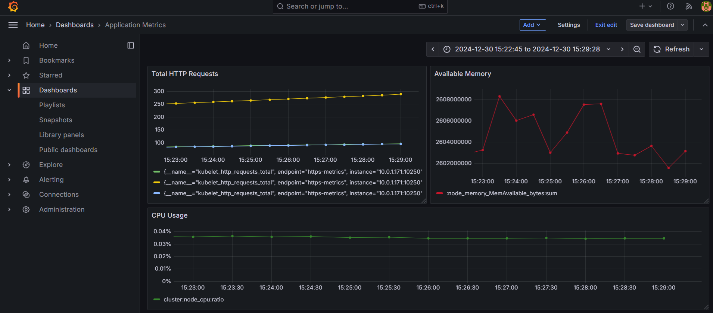
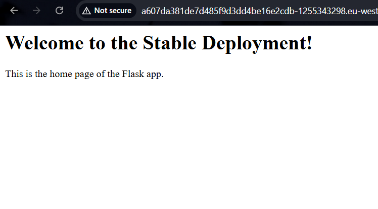
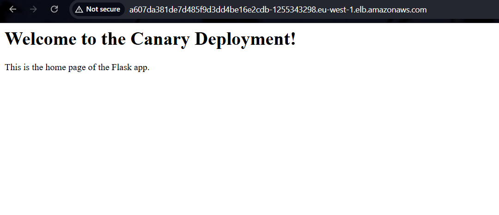
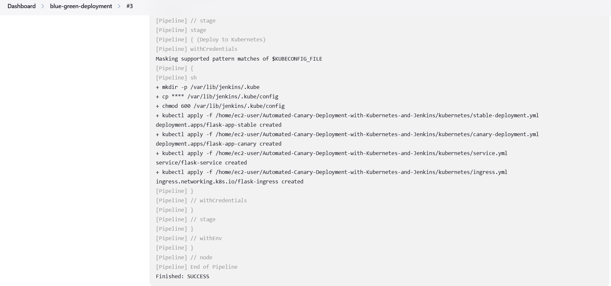

# Automated-Canary-Deployment-with-Kubernetes-and-Jenkins

This project demonstrates a Kubernetes Canary Deployment workflow integrated with monitoring and visualization using Grafana and Prometheus. The deployment process is automated via Jenkins, ensuring a streamlined and reliable CI/CD pipeline.

## Project Overview

- **Cluster Setup**: A Kubernetes cluster is provisioned to manage application deployments.
- **Monitoring**: Grafana is integrated with Prometheus to visualize application metrics and system health.
- **Canary Deployment**: A Canary strategy is implemented to gradually roll out new versions of the application.
- **CI/CD Pipeline**: Jenkins automates the build and deployment processes.

## Features

1. **Grafana Dashboard**: 
   - Visualizes metrics collected by Prometheus.
   - Monitors application performance and resource usage.
2. **Stable and Canary Deployments**: 
   - Stable version of the application ensures reliability.
   - Canary deployment allows testing of new features with minimal risk.
3. **Jenkins Integration**:
   - Automates the CI/CD process from build to deployment.
   - Logs all pipeline activities for traceability.

## Prerequisites
- Setup from previous project (https://github.com/riajul-98/CI-CD-Pipeline-for-Containerized-App)
- Kubernetes cluster.
- Jenkins server with appropriate plugins.
- Prometheus and Grafana installed in the cluster.

## Setup and Configuration

1. **Setup Monitoring**:
   - Install Prometheus and Grafana in the Kubernetes cluster.
   - Configure Prometheus as a data source in Grafana.
   - Import dashboards for application monitoring.

2. **Deploy Application**:
   - Deploy the stable version of the application.
   - Create and configure the Canary deployment.

3. **Configure Jenkins**:
   - Create a Jenkins pipeline for the deployment.
   - Define stages for building, testing, and deploying the application.

## Key Screenshots

### 1. Grafana Dashboard

### 2. Stable Application

### 3. Canary Deployment

### 4. Jenkins Console Output

## How It Works

1. **Monitoring Setup**: Prometheus scrapes metrics from the application and Kubernetes components. Grafana visualizes these metrics.
2. **Stable Deployment**: The stable version serves production traffic.
3. **Canary Deployment**: A new version is gradually rolled out to a subset of users. Monitoring ensures the new version meets performance standards before full deployment.
4. **Jenkins Automation**: The Jenkins pipeline orchestrates the build, test, and deployment stages, minimizing manual intervention.

## Lessons Learned

- Canary deployments reduce risks associated with application updates.
- Integration of monitoring tools provides valuable insights into application performance.
- Jenkins pipelines streamline the CI/CD process and ensure consistency.

## Conclusion

This project successfully demonstrates how to integrate Kubernetes Canary Deployments with Grafana and Jenkins. The setup enhances application reliability and enables safe, gradual rollouts of new features.
